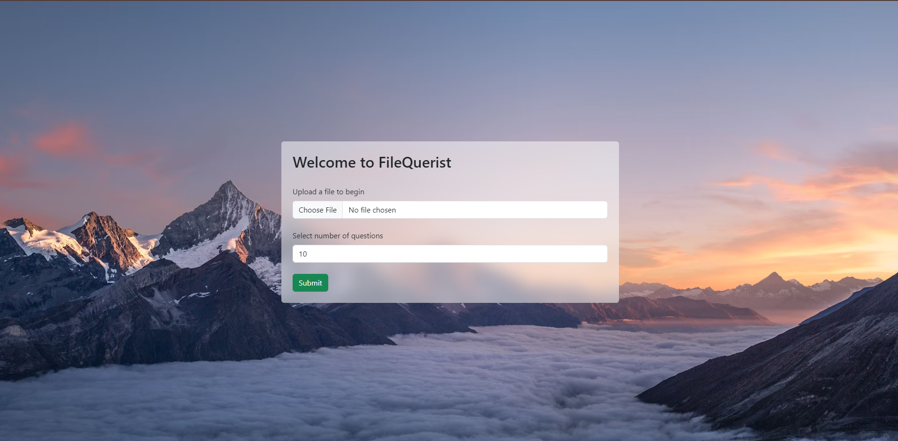
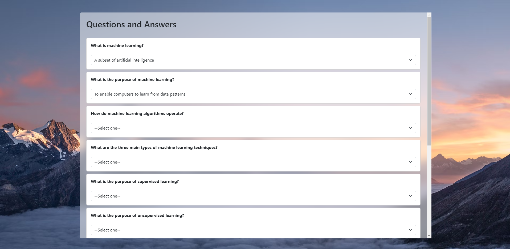
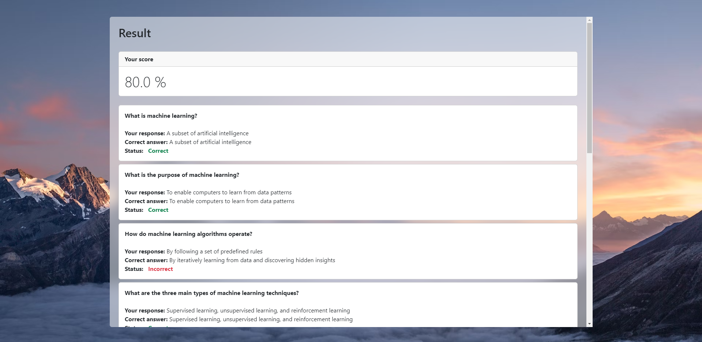

# FileQuerist

A Web app built using Python (Flask) that leverages Google's State-of-the-art Gemini Pro Large Language Model. The app tests you by giving you multiple choice questions based on the contents of the file.

It is like your exam prep teacher/helper.

## Screenshots





## Running locally

1) Clone the repo
```bash
git clone https://github.com/neutr0nStar/FileQuerist
```

2) Create virtual environment, activate it and install requirements
```bash
python -m venv .venv
.venv\Scripts\activate
pip install -r requirements.txt
```

3) Create a ```.env``` file, and put your Gemini API key there.
```env
GOOGLE_API_KEY=...
```

4) Start the server
```bash
python server.py
```


## Notes
1. The model is not perfect, and sometimes that app doesn't work as intended, in that case, please refresh or restart.

2. Currently, it only takes text files as input. But in future, it can be expanded to also read pdf and doc files (even websites).